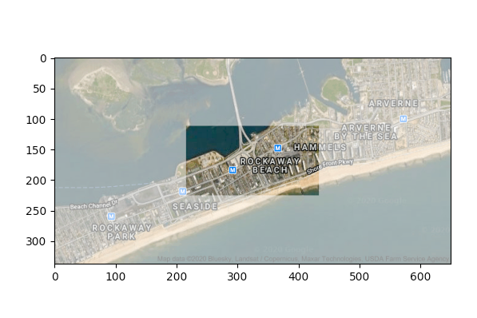
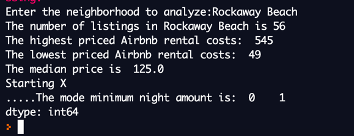
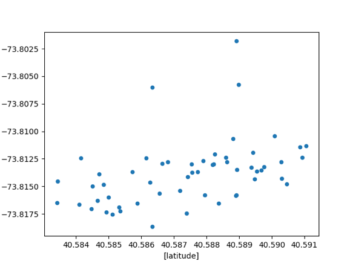
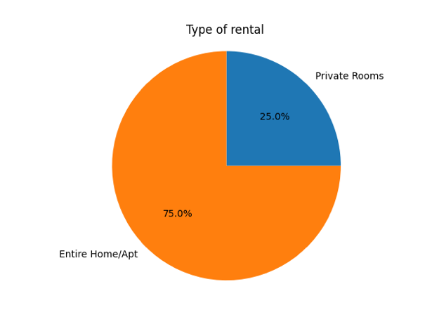
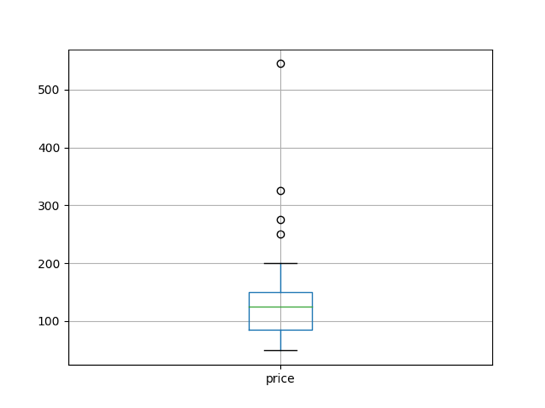
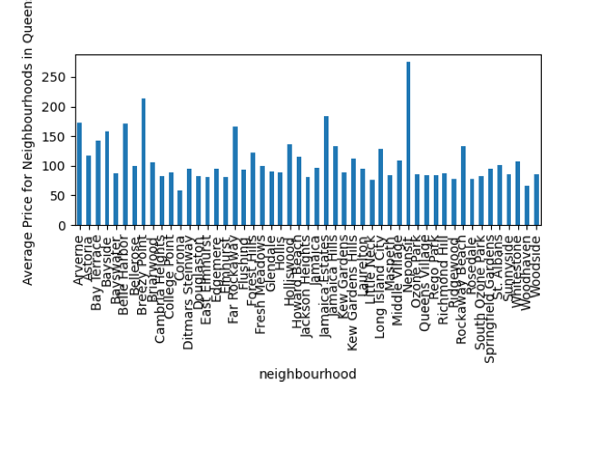

# Rockaway Beach

# Demographics/ Statistics
  
  Rockaway Beach, located in Queens, New York, has a population of 21,354 individuals. 
  Its zip code is 11694. Rockaway Beach takes up 1.34 square miles, so there is roughly 
  15,980.51 people per square mile. The median age of its residents is 48.5 such that 
  19.63% of its population is under 18 years old, 15.57% is 18-34, 44.35% is 35-64, and 
  20.46% is 65 and over. About 51.19% of the population is male and 48.81% is female. 
  When considering education, 10.34% of the population had less than a high school education, 
  89.66% were high school graduates or higher, and 43.44% had a Bachelor’s degree or higher. 
  When looking at languages spoken, 79.26% of the population speak English at home, 10.96% 
  spoke Spanish, 7.01% spoke Indo-European, 1.74% spoke Asian/ Islander, and 1.04% spoke 
  another language at home. The per capita income is $45,846 and the median household income 
  is $80,976 such that 31.57% of households made less than $50,000, 29.61% of households 
  earned between $50,000 and $100,000, 25.99% of households earned between $100,000 and $200,000, 
  and 12.84% of households earned over $200,000. As a result, 9.89% of the population lives 
  below the poverty level. When looking at transportation, one finds that the average commute 
  to work is 47 minutes and that the overwhelming majority (59.21%) of people drove alone 
  to work, 24.22% used public transit, 5.59% carpooled, 5.79% walked, and the rest has other 
  forms of transportation. When considering marital status, about 49.38%of individuals were 
  single while 51.63% were married.  Housing units and occupancy were also analyzed. Rockaway 
  Beach has about 9,492 housing units with 89.21% being occupied and 10.79% being vacant. 
  Of the occupied housing units, 53.2% were occupied by owners and 46.8% were occupied by 
  renters. Of the vacant housing units, 27.83% were for rent and 0.88% were for sale. 
 
## Commute
   
   The Q22, Q35 local bus, and the Q53 SBS serve the Rockaway Beach area. The QM16 express 
   bus goes to Manhattan. The neighborhood's New York City Subway stations are Beach 90th 
   Street and Beach 98th Street, served by the A and S trains. The Q35 goes to the Flatbush 
   Avenue – Brooklyn College subway station (2 and 5 trains) in Midwood, Brooklyn, and the 
   Q53 SBS connects with the 61st Street – Woodside subway station (7 train) and the
   Woodside LIRR station in Woodside. The average commute to work is 47 minutes and that the 
   overwhelming majority (59.21%) of people drive alone to work, 24.22% use public transit, 
   5.59% carpool, 5.79% walk, and the rest have other forms of transportation. 
  
# Safety
   
   The Rockaways, as a whole, have a relatively low crime rate. The total crime rate is 26% lower 
   than the national average. In fact, property crime is 45% lower than the national average. However, 
   violent crime is 79% more than the national average which may hinder you choice to move here.
  
# Diversity
   
   Rockaway Beach has a diverse population. 73% of the population is White, 14.91% is Hispanic,
   6.01% is Black, 3.47% is Asian, 0.67% is AIAN, 0.96% is two+, and 0.97% is other. 85.31% of the 
   population was born in the United States while 14.69% is foreign born. Of the population born 
   elsewhere, 39.86% were born in Latin America, 37.79% were born in Europe, 17.25% were born in 
   Asia, 3.79% were born in Africa, 1.15% were born in North America, and 0.16% were born in Oceana. 
  
# Data Analysis
  
 
  
   For this assignment, my goal was to present the data from the Airbnb spreadsheet using different 
   plots to help visualize the information and statistics. I used a scatterplot, pie chart, bar graph, 
   and box plot. 
   
 
   
   When creating the scatterplot, I used latitude and longitude to plot where each of the listings in 
   Rockaway Beach are. I noticed that the majority of the listings were located closer to the beach 
   in the south and there were 3 outliers further north. It makes sense that the majority of the houses 
   are closer to the south because this is closer to the public transportation which I learned more 
   about in HC2 and HC3. More specifically, these houses are located closer to the Q22, Q35 local bus, 
   and the Q53 SBS. Roughly 24.22% of residents in Rockaway Beach use public transit in their daily commute. 
   
  
   
   When creating the pie chart, I was surprised to see that 75% of rentals were entire homes while 25% 
   were private rooms. This was shocking to me because Rockaway Beach has about 9,492 housing units 
   with 89.21% being occupied and 10.79% being vacant. Of the occupied housing units, 53.2% were 
   occupied by owners and 46.8% were occupied by renters. Of the vacant housing units, 27.83% were 
   for rent and 0.88% were for sale. I thought the pie chart would be more evenly split.
   
  
   
   When examining the boxplot of the rental prices in Rockaway Beach, one can notice 3 outliers which would 
   skew the mean price. For this reason, I think the median would be a better representation for the 
   center of the data. 
   
  
   
   When examining the bar graph of all Queens, it is apparent that Rockaway Beach listings are generally 
   only a little more expensive than listings in other areas. However, because I believe the median is 
   a better indication of the center and the median is slightly lower than the mean due to the 3 outliers, 
   I would say the average price in Rockaway Beach (discounting the outliers) is very close to the average 
   price of Queens as a whole.

